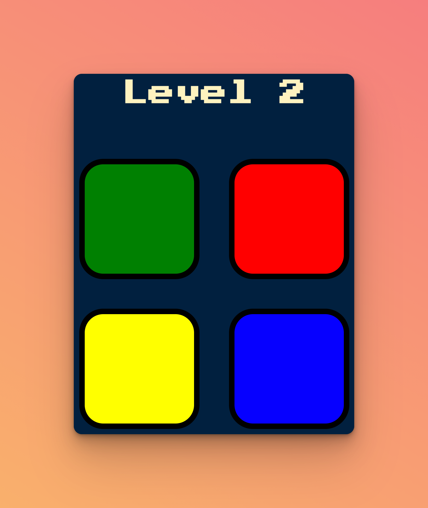

# Simon Game

## Description

This is a web-based version of the classic Simon Game, created as part of The App Brewery's Web Development Bootcamp. It's designed to showcase the use of jQuery for handling user interactions and animations. Players are challenged to remember and replicate an increasingly complex series of lights and sounds.



## Installation

To get started, clone this repository to your local machine:

```bash
Copy code
git clone https://github.com/[YourUsername]/simon-game.git
cd simon-game
```

No additional installation is needed. Simply open index.html in a web browser to play the game.

## Usage

Open the index.html file in a web browser. The game starts with any key press. Follow the sequence of colored buttons that light up and try to keep up as the pattern grows longer with each round.

## Learning Outcomes

-   Using jQuery for DOM manipulation and event handling.
-   Applying CSS animations to enhance user experience.
-   Implementing game logic in JavaScript.

## License

This project is open-source, available under the MIT License. See LICENSE file for details.

## Acknowledgements

The App Brewery's Web Development Bootcamp for the educational resources.
